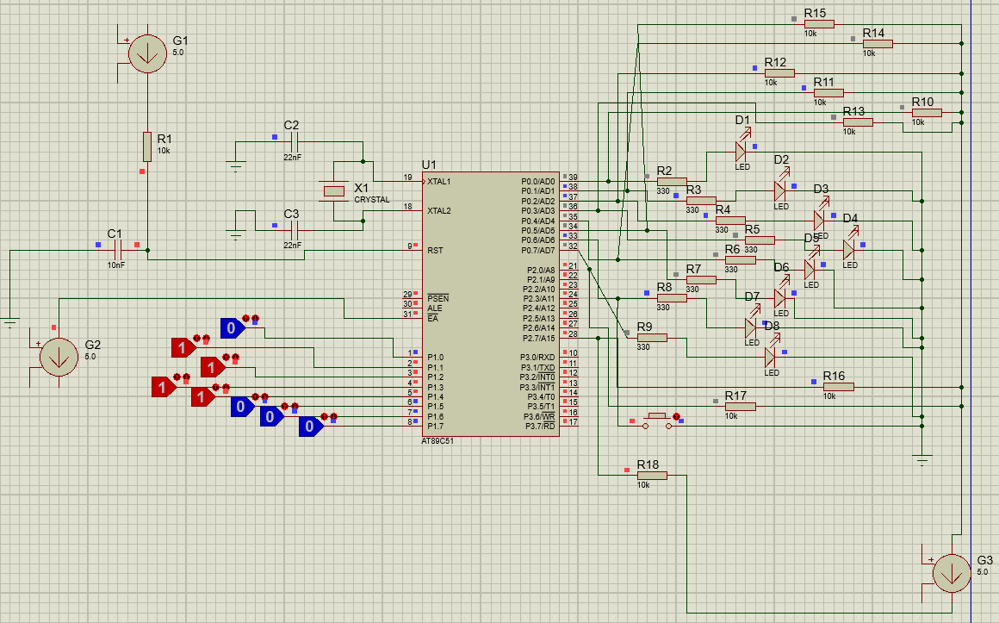
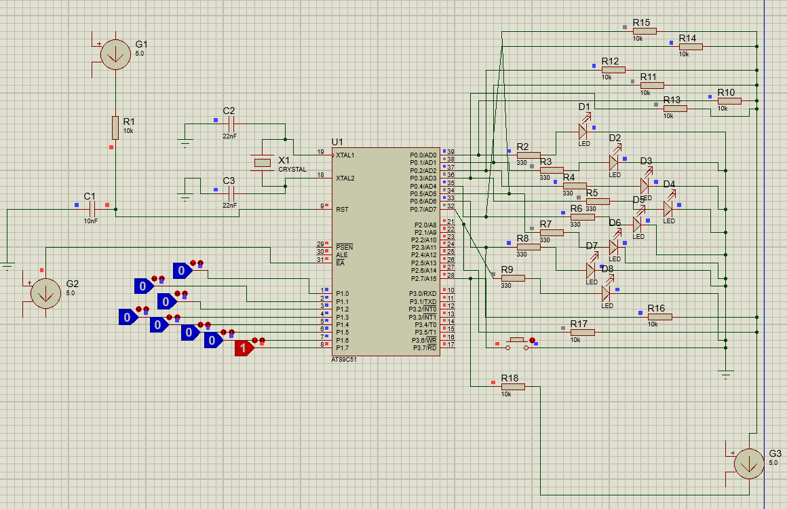
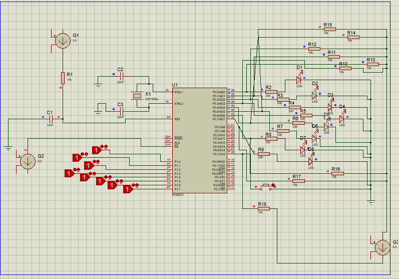

# 8051 Assembly LED Control Project

This is a simple project I made for my Microprocessors course. I used the AT89C51 microcontroller to control LEDs based on different input values.

## 🛠 Tools I Used
- **Language:** 8051 Assembly
- **Software:** Keil µVision and Proteus (for simulation)

## 📋 How It Works
The program checks the input from **Port 1**. Depending on the number, different LEDs on **Port 0** turn on:
- **If input is 30:** LED pattern becomes `0xB9`.
- **If input is 128:** LED pattern becomes `0xAA`.
- **If input is 255:** LED pattern becomes `0xF0`.
- **Reset:** There is a button on **P2.7**. When you press it, all LEDs turn off.

## 📂 Project Folders
- `src/`: My Assembly code (`.asm`).
- `simulation/`: Proteus design file.
- `sim-outputs/`: Screenshots of my simulation results.

## 📸 Simulation Results

| Input: 30 | Input: 128 | Input: 255 |
| :---: | :---: | :---: |
|  |  |  |

*(Note: Please ensure the image filenames in the `sim-outputs` folder match the names in the code above.)*
